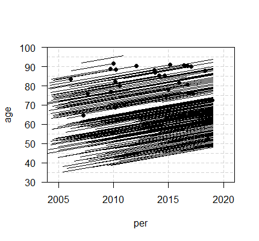
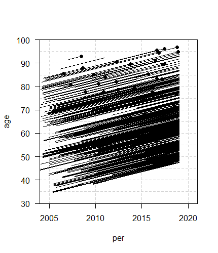

&nbsp;
<script>
   $(document).ready(function() {
     $head = $('#header');
     $head.prepend('')
     $head.prepend('')
     $head.prepend('')
   });
</script>

****

## 0. Estado:

**Últimas actualizaciones** 

&check; Análisis Descriptivo.  <br/>
&check; Gráfica Lexis.  <br/>
&check; Modelo de Poisson Tasas de Mortalidad.  <br/>


**Realizado**

&check; Análisis Descriptivo  <br/>
&check; Gráfica Lexis         <br/>
&check; Modelo de Poisson Tasas de Mortalidad.  <br/>

**Pendiente**

* Revisión  y depuración de errores 
* Edición de tablas 

## 1. Objectivos Principales

- Análisis de las tendencias en mortalidad a lo largo del tiempo  de todas las causas entre el 01.01.2004 y la   captura más reciente del SIDIAP (31.12.2018) en personas con reciente diabetes tipo 2 y en comparación con 1 población control sin diabetes.

- Análisis de las diferncias y las proporciones de las tasas  en mortalidad a lo largo del tiempo  de todas las causas entre el 01.01.2004 y la   captura más reciente del SIDIAP (31.12.2018) en personas con reciente diabetes tipo 2 y en comparación con 1 población control sin diabetes.

## 2. Objectivos Secundarios

- Análisis de las tendencias en mortalidad cardiovascular a lo largo del tiempo  de todas las causas entre el 01.01.2004 y la   captura más reciente del SIDIAP (31.12.2018) en personas con reciente diabetes tipo 2 y en comparación con 1 población control sin diabetes.

- Análisis de las diferncias y las proporciones de las tasas  en mortalidad  cardiovascular  a lo largo del tiempo  de todas las causas entre el 01.01.2004 y la   captura más reciente del SIDIAP (31.12.2018) en personas con reciente diabetes tipo 2 y en comparación con 1 población control sin diabetes.

- Comparar las tendencias de las tasas de mortalidad y de ratio entre los diferentes países.

- Análisis de las tendencias del tiempo en condiciones renales cardiometabòliques.


## 3. Métodes

* Tipo de estudio:
  + Estudio Observacional Retrospectivo de 2 Cohortes Apareadas 1:5 (Sexo,Año de nacimiento,Zona Geográfica)
  + Cohorte-Grupo de Casos:Población Diabética íncidente(1)   
  + Cohorte-Grupo de Controles:Población No Diabética íncidente(5)


* Grupo de Casos (diabéticos incidentes):
   + Tener un nuevo diagnóstico de DM2 no dado de baja registrado durante 2004-2018.La fecha del primer diagnóstico de DM2 pasará a ser la fecha de índice.[DINDEX].
   + Tener 35 años o más en índice.[DINDEX].
   + Tener mínimo un año de historia clínica previa antes de índice[DINDEX].


* Grupo de Controles potenciales(Los Controles heretan la fecha de índice[DINDEX]de su Caso,cumpliendo las siguientes condiciones:)
   + Tener 35 años o más en índice.[DINDEX].
   + Estar asignados al SIDIAP en índice.[DINDEX].
   + Tener mínimo un año de historia clínica previa antes de la fecha índice[DINDEX].
   
   
## 4. Período de observación:

* 1 de enero del 2004  a 31 de diciembre del 2018

## 5. Análisis Estadístico

* Se describe el perfil demográfico y clínico del Grupo Caso(Diabético) incluidos, empreando los estadísticos más adecuados en cada caso en función del tipo de variable. 

* Se describe el perfil demográfico y clínico del Grupo Control incluidos.  empreando los estadísticos más adecuados en cada caso en función del tipo de variable.

* Generamos una curva de supervivencia, con el método Kaplan-Meier para ara el Grupo Caso(Diabético) y Grupo Control.(figura1)

* Aplicamos un Diagrama de Lexis para el Grupo Caso(Diabético) y Grupo Control.(figura2)

* Modelo lineal generalizado para ajustar una regresión de Poisson de la Tasas de  todo tipo de Mortalidad ,para el Grupo Caso(Diabético) y Grupo Control. (figura3)


```{r setup, include = FALSE}
knitr::opts_chunk$set(echo = FALSE, message=FALSE, warning=FALSE, include=F,size="huge")
library(ggplot2)
library(dplyr)
# CArrego funcions -------------------
link_source<-paste0("https://github.com/jrealgatius/Stat_codis/blob/master/funcions_propies.R","?raw=T")
devtools::source_url(link_source)

#   template: template.html
```


```{r utilsrmarkdown}
# 
```


```{r lectura, echo=FALSE, message=FALSE, warning=FALSE}
# Carrega dades
# load(here::here("resultats","nomarxiu.Rdata"))
# read.csv(here::here("resultats","Nomarxiu.csv"))
# foreign::read.spss(here::here("dades","nomarxiu.sav"),labels=T)

```


```{r preparacio,include=F}


```

## 6. Resultados

```{r, message=FALSE, warning=FALSE, include=T, echo=FALSE,size="huge"}
####  Llegir dades    #####
load("DataHarmonization.Rdata")
#Taula1
export2md(T00,caption="**perfil demográfico y clínico del Grupo Caso(Diabético) Y Grupo Control**")
```

```{r, message=FALSE, warning=FALSE, include=T, echo=FALSE,size="huge"}

'curva de supervivencia, con el método Kaplan-Meier para ara el Grupo Caso(Diabético) y Grupo Control.(figura1)'
figura1

```

* Aplicamos un Diagrama de Lexis para el Grupo Caso(Diabético)(figura2a)



* Aplicamos un Diagrama de Lexis para el Grupo Control(figura2b).




```{r, message=FALSE, warning=FALSE, include=T, echo=FALSE,size="huge"}

'Modelo lineal generalizado para ajustar una regresión de Poisson de la Tasas de  todo tipo de Mortalidad ,para el Grupo Caso(Diabético).(figura3)'
figura3

'Modelo lineal generalizado para ajustar una regresión de Poisson de la Tasas de  todo tipo de Mortalidad ,para e Grupo Control.(figura4)'
figura4

```


```


&nbsp;
<hr />
<p style="text-align: center;">A work by $Jordi Real$ </a></p>
<p style="text-align: center;"><span style="color: #808080;"><em><https://github.com/USR-DAPCAT/></em></span></p>


